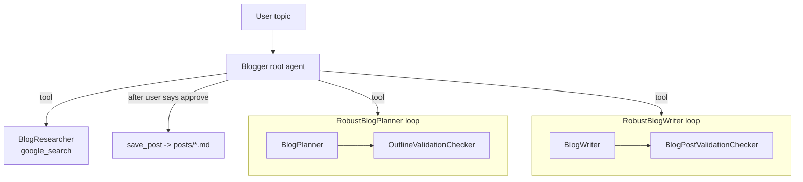

# Blogger: Multi-Agent Blog Generator (Google ADK)

An orchestrator agent that **researches** a topic on the web, **plans** an outline, **writes** a cited
article, has **critic agents** review each stage, and **saves only after human approval**.



## What was added to the original version
| Upgrade | Detail |
|---|---|
| Web research | `BlogResearcher` uses `google_search`; writer cites sources as [n] with a Sources list |
| Structured validation | Checkers return a Pydantic `Review` (score, approved, issues) instead of "ok"/"retry" text |
| Real early exit | `after_agent_callback` sets `escalate=True` when approved, so no wasted iterations |
| Human-in-the-loop | `before_tool_callback` blocks `save_post` until the user replies "approve" |
| Safe tool | `save_post` sanitizes filenames, caps size, writes only to `posts/` |
| Reliability | Retry with backoff on 429/503 for every agent |
| Cost tracking | `after_model_callback` accumulates tokens per run |
| Prompt-injection hygiene | Search content is treated as data, not instructions |
| Evaluation harness | `evals/run_eval.py` runs 10 fixed topics and writes `evals/results.json` |

## Run
```bash
pip install -r requirements.txt
adk web                      # pick blog_agent, send a topic, then reply "approve"
python -m evals.run_eval     # metrics over 10 topics
```

## Results (fill in from `evals/results.json`)
| Metric | Value |
|---|---|
| Approval rate | |
| Avg critic score | |
| Avg planner / writer rounds | |
| Avg sources per post | |
| Avg tokens per post | |
| Avg latency (s) | |

## Known limitations
- The critic is an LLM judging an LLM. `sources` and `words` in the eval are independent checks.
- Approval gate matches simple approval messages; production would use ADK's tool-confirmation flow.
- Next: tracing (Langfuse/OpenTelemetry), cheaper model for critics, deployment behind FastAPI.
