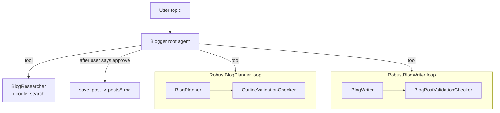

# Blogger: Multi-Agent Blog Generator (Google ADK)

An orchestrator agent that **researches** a topic on the web, **plans** an outline, **writes** a cited
article, has **critic agents** review each stage, and **saves only after human approval**.



## Run
```bash
pip install -r requirements.txt
adk web                      # pick blog_agent, send a topic, then reply "approve"
python -m evals.run_eval     # metrics over 10 topics
```
